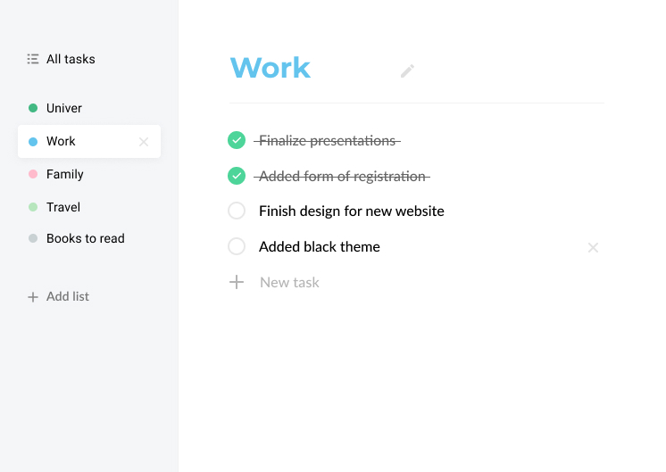
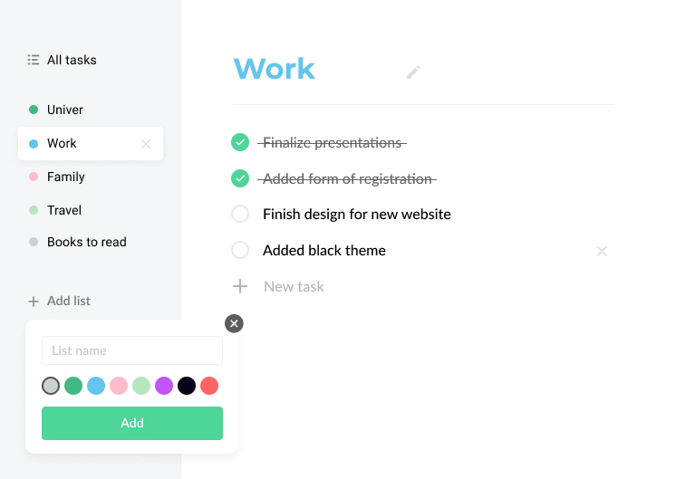
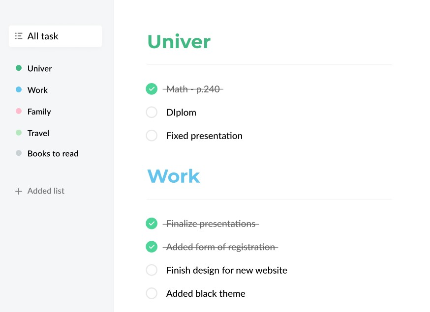

# Todo app

[You can see screenshots of the todo-app below](#screenshots)

## Usage

### Installation

Install the dependencies

1. `npm install` или `yarn install`
2. Run command `npm start` or `yarn start`.

## Stack:

- ReactJS + hooks
- React Router
- json-server
- Axios
- classnames

## <a name="screenshots">Screenshots</a>

  
 
  
  
  

